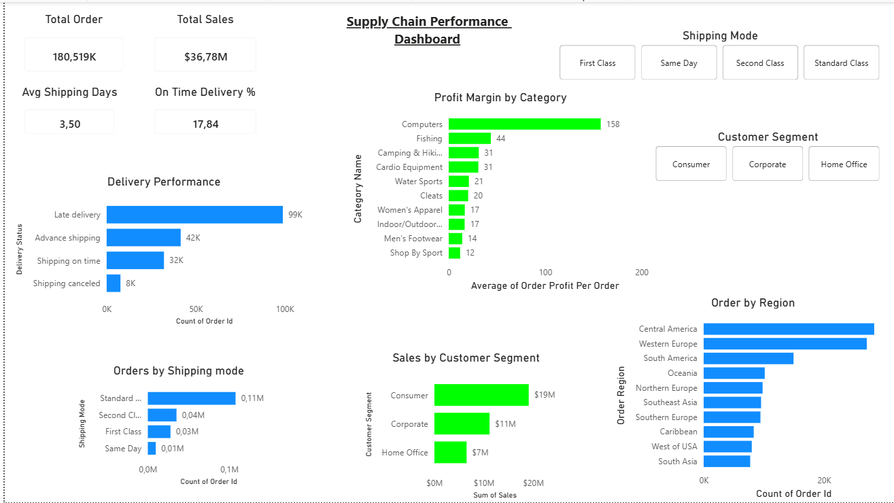

# Supply Chain Performance Analysis
## By Jurgens Pretorius | Operations & Data Analytics

## Project Overview
This project analyses 180,519 supply chain orders from the DataCo Smart Supply Chain 
dataset using SQL. The analysis covers delivery performance, product profitability, 
shipping mode efficiency, customer segmentation, and regional order distribution.

The dataset was queried using SQLite and the results were visualised in a 
Power BI dashboard.

## Tools Used
- SQLite / DB Browser for SQLite
- Power BI Desktop
- Dataset: DataCo Smart Supply Chain (Kaggle)

## Key Findings
- Only 17.84% of orders shipped on time — 54.83% experienced late delivery
- Computers is the highest margin product category at 158 average profit per order
- Standard Class shipping accounts for 59.69% of all orders but averages 4 days delivery
- Consumer segment drives 51.8% of order volume and $19M in sales
- Late delivery risk flag confirmed as an outcome measure, not a predictive indicator

## Dashboard

## Queries
- [Query 1 — Delivery Performance](Queries/Query1_Delivery_Performance.sql)
- [Query 2 — Profit by Category](Queries/Query2_Profit_by_Category.sql)
- [Query 3 — Shipping Mode Analysis](Queries/Query3_Shipping_Mode.sql)
- [Query 4 — Customer Segment](Queries/Query4_Customer_Segment.sql)
- [Query 5 — Late Delivery Risk](Queries/Query5_Late_Delivery_Risk.sql)
- [Query 6 — Order Status by Region](Queries/Query6_Order_Status_Region.sql)

## Power BI File
- [Download Dashboard (.pbix)](Power%20BI/Supply%20Chain%20Performance%20Dashboard.pbix)
